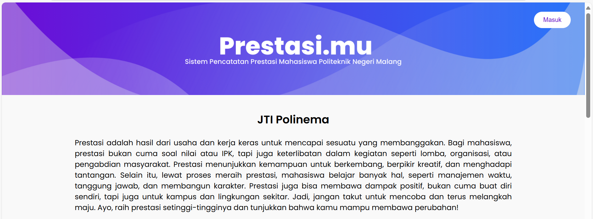
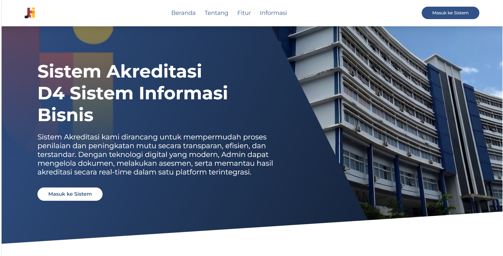

# Hi there 👋 I'm Reza Angelina Febriyanti

✨ Information Systems Student at Politeknik Negeri Malang | System Analyst & Database Designer with Backend Development Skills

---

## 👩‍💻 About Me

* 🎓 Information Systems Student
* 💡 Passionate in System Analysis, Backend Development, and Database Design
* 🚀 Experienced in managing and developing real-world systems
* 🧠 Strong analytical thinking in designing efficient and scalable systems

---

## 🔥 Highlight Experience

### 📌 SiPresma (Sistem Prestasi Mahasiswa)

🔗 [View Repository](https://github.com/RezaAngelinaFebriyanti/ProjectSistemPencatatanPrestasi.git)
📘 [Documentation](https://drive.google.com/file/d/17NPjxCgl0iONHkhcejFrN4PxK8A90b_0/view?usp=sharing)

**Role: Project Manager & Backend Developer**

* Defined core features at the early stage of system development
* Designed system workflows using activity diagrams
* Managed role-based system flow (landing page → authentication → dashboard)
* Coordinated team tasks and maintained development logbook
* Designed and implemented database architecture
* Developed backend system using Laravel

---

### 📌 SiAKRED (Sistem Akreditasi Kampus)

🔗 [View Repository](https://github.com/RezaAngelinaFebriyanti/PBL_Akreditasi.git)
📘 [Documentation](https://drive.google.com/file/d/1ULgcVesvPv8XhPHFuXFxiU_3-9rvRK8B/view?usp=sharing)

**Role: Backend Developer**

* Implemented CRUD functionality for accreditation criteria (1–9)
* Developed backend using Laravel framework
* Ensured data validation and structured data management

---

## 🧠 Core Skills

### 🔍 System Analysis & Design

* Activity Diagram
* Use Case Diagram
* Data Flow Diagram (DFD)
* Business Process Model and Notation (BPMN)
* Requirement Analysis & Feature Planning

### 🗄 Database Design

* ERD Chen
* ERD Martin
* Conceptual Data Model (CDM)
* Physical Data Model (PDM)
* Database normalization & optimization

### ⚙ Backend Development

* Laravel (PHP Framework)
* CRUD System Development

### 🧰 Tools & Technologies

* 🛠 Draw.io
* 🛠 Power Designer
* 🛠 MySQL
* 🛠 SQL Server
* 🛠 Odoo (Business Process & ERP)

---

## 🌟 Strengths

* Strong critical thinking in system design
* Able to translate user requirements into structured system architecture
* Experienced in both technical and managerial roles
* Detail-oriented in database and system workflow design

---

## 📫 Contact Me

* 📧 Email: [rzangef15@email.com](mailto:rzangef15@email.com)
* 💼 LinkedIn: [linkedin.com/in/rzangef](https://www.linkedin.com/in/rzangef/)
